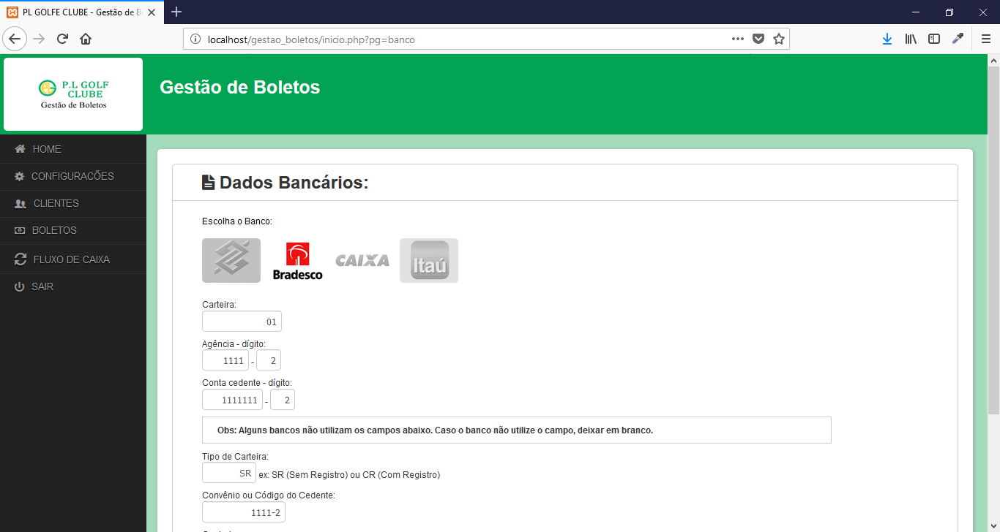

# Gestão de Boletos

Projeto criado para geração de boletos bancários com lançamento de faturas e fluxo de caixa.

## Características

- Configuração do Banco para gerar o Boleto
- Configuração do Boleto
- Configuração do Email para enviar o Boleto
- Cadastro de Grupos
- Cadastro de Clientes
- Lançamento de Faturas
- Fluxo de Caixa

## Tecnologias

- PHP
- JS
- Jquery
- CSS

## Instalação

```shell

$ git clone https://github.com/danilomeneghel/gestao_boletos.git

$ mysql -u <your user> -p <your password>

mysql> create database `gestao_boletos`;

```

Feito isso, importe o arquivo $db/gestao_boletos.sql para o seu MySql.

## Conexão

Para acessar o painel entre com o seguinte login:

	- Usuário: admin
	- Senha: admin
	
## Licença

Gestão de Boletos está licenciado por <a href="LICENSE">GNU GENERAL PUBLIC LICENSE</a>.

## Screenshots

<br><br>
<br><br>
<br><br>
<br><br>
<br><br>
<br><br>
